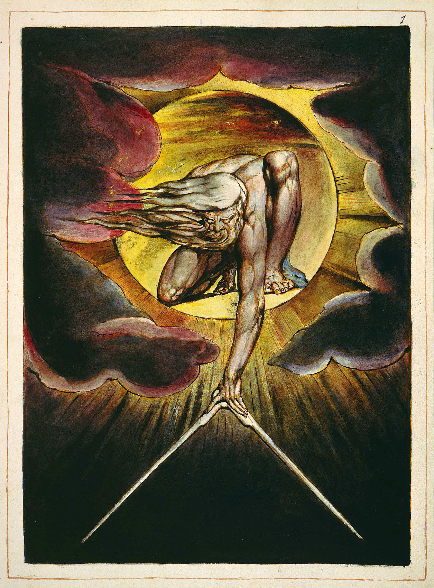

# Art

## Favorite Artworks

### Crucifixion (Corpus Hypercubus) - Salvador Dali

An expression of the polyhedral net of a 4-dimensional hypercube. The unfolding is exemplified as a cross, which Salvador Dalí fashioned in 1954 as a depiction of the crucifixion of Jesus of Nazareth.

### The Ancient of Days - William Blake

[The Ancient of Days](https://en.wikipedia.org/wiki/The_Ancient_of_Days) setting a Compass to the Earth, frontispiece to copy K of [Europe a Prophecy](https://en.wikipedia.org/wiki/Europe_a_Prophecy).

## Favorite Artists

William Blake [The William Blake Archive](http://www.blakearchive.org)